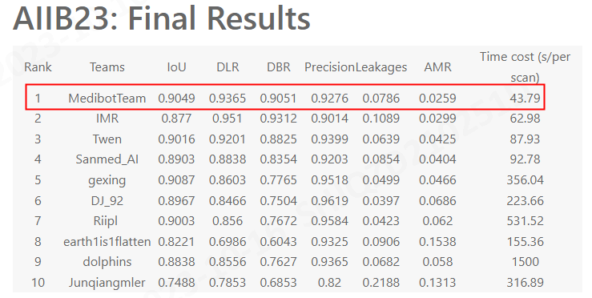

# Top1 Solution (MedibotTeam) of MICCAI2023 AIIB23 Challenge
## Final Results
You can find the challenge page and the final result [here](https://codalab.lisn.upsaclay.fr/competitions/13238#learn_the_details-final-results) 



## Docker
The docker we submitted can be download from the [Google Drive Link](https://drive.google.com/file/d/1kj-v680HwPnCcJvpr6jJ1qij_DzAf4FX/view?usp=sharing)

You can run the docker by 

Step 1: docker uncompressed and load
```
 gzip -d -c [docker_path] | docker load 
```
Step 2: run the docker
```
 docker run --gpus "device=0" --rm -v [input directory]:/inputs -v [output directory]:/outputs -it medibot
```
## Code
The code is derived from [ATM2022 Top1 Solution](https://github.com/TangWen920812/ATM2022.git), offical code of [Alleviating Class-wise Gradient Imbalance for Pulmonary Airway Segmentation](https://arxiv.org/abs/2011.11952) and [Refined Local-imbalance-based Weight for Airway Segmentation in CT](https://link.springer.com/chapter/10.1007/978-3-030-87193-2_39)

## References
[1.	Puyang Wang. Accurate Airway Tree Segmentation in CT Scans via Anatomy-aware Multi-class Segmentation and Topology-guided Iterative Learning. Arxiv. 2023.](https://arxiv.org/abs/2306.09116)

[2.	Hao Zheng. Refined Local-imbalance-based Weight for Airway Segmentation in CT. MICCAI 2021](https://link.springer.com/chapter/10.1007/978-3-030-87193-2_39)

[3.	Yang Nan. Fuzzy Attention Neural Network to Tackle Discontinuity in Airway Segmentation. IEEE Transaction on Neural Networks and Learning Systems. 2022](https://ieeexplore.ieee.org/document/10129972)

[4.	Hao Zheng. Alleviating Class-Wise Gradient Imbalance for Pulmonary Airway Segmentation. IEEE Transaction on Medical Analysis. 2021](https://arxiv.org/abs/2011.11952)

[5. Minghui Zhang. Multi-site, Multi-domain Airway Tree Modeling. MIA. 2023](https://www.sciencedirect.com/science/article/abs/pii/S1361841523002177)

[6.	Isensee, F., Jaeger, P. F., Kohl, S. A., Petersen, J., & Maier-Hein, K. H. nnU-Net: a self-configuring method for deep learning-based biomedical image segmentation. Nature methods, 2021.](https://www.nature.com/articles/s41592-020-01008-z)


